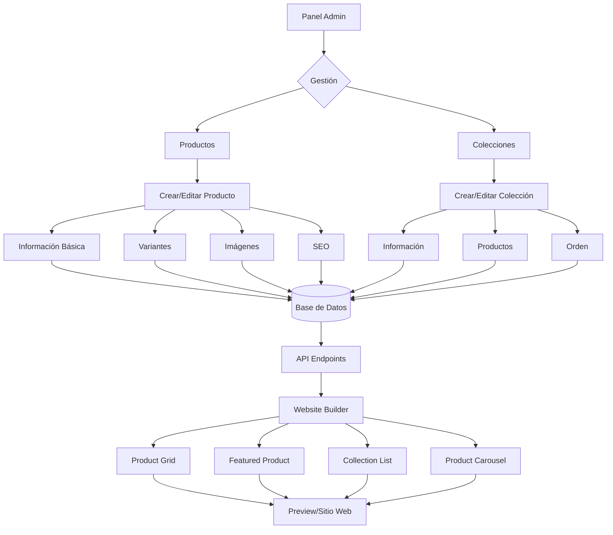

# 🛍️ Plan de Implementación: Sistema de Colecciones y Productos

## 📋 Resumen Ejecutivo

Este documento detalla el plan completo para implementar un sistema de gestión de colecciones y productos tipo Shopify en el proyecto Hotel23. El sistema se desarrollará **fuera del Website Builder** como módulos principales del panel administrativo, permitiendo que el Website Builder consuma estos datos a través de APIs.

**Fecha de creación**: Enero 2025  
**Estado**: En planificación  
**Prioridad**: Alta

---

## 🎯 Objetivos

1. **Crear un sistema robusto** de gestión de productos y colecciones
2. **Mantener separación de responsabilidades** entre el catálogo y el builder
3. **Replicar la UX de Shopify** para facilidad de uso
4. **Permitir integración fluida** con el Website Builder
5. **Preparar la base** para futuras funcionalidades (inventario, órdenes, etc.)

---

## 🏗️ Arquitectura del Sistema

### 1. Estructura de Archivos

```
Hotel23/
├── Controllers/
│   ├── CollectionsController.cs          [NUEVO]
│   ├── ProductsController.cs             [NUEVO]
│   ├── ProductImagesController.cs        [NUEVO]
│   └── WebsiteBuilderController.cs       [MODIFICAR - agregar endpoints]
│
├── Models/
│   ├── Collection.cs                     [NUEVO]
│   ├── Product.cs                        [NUEVO]
│   ├── ProductImage.cs                   [NUEVO]
│   ├── ProductVariant.cs                 [NUEVO]
│   ├── CollectionProduct.cs              [NUEVO]
│   └── HotelDbContext.cs                 [MODIFICAR - agregar DbSets]
│
├── Views/
│   ├── Collections/                      [NUEVO]
│   │   ├── Index.cshtml
│   │   ├── Create.cshtml
│   │   ├── Edit.cshtml
│   │   ├── Details.cshtml
│   │   └── _CollectionCard.cshtml
│   │
│   ├── Products/                         [NUEVO]
│   │   ├── Index.cshtml
│   │   ├── Create.cshtml
│   │   ├── Edit.cshtml
│   │   ├── Details.cshtml
│   │   ├── _ProductCard.cshtml
│   │   ├── _VariantForm.cshtml
│   │   └── _ImageUploader.cshtml
│   │
│   └── Shared/
│       └── _Layout.cshtml                [MODIFICAR - agregar menú items]
│
├── wwwroot/
│   ├── css/
│   │   ├── products.css                  [NUEVO]
│   │   └── collections.css               [NUEVO]
│   │
│   └── js/
│       ├── products/                     [NUEVO]
│       │   ├── product-form.js
│       │   ├── variant-manager.js
│       │   └── image-uploader.js
│       │
│       └── website-builder/modules/      [NUEVOS MÓDULOS]
│           ├── product-grid.js
│           ├── featured-product.js
│           ├── collection-list.js
│           └── product-carousel.js
```

### 2. Modelos de Datos

#### Collection.cs
```csharp
public class Collection
{
    public int Id { get; set; }
    public string Title { get; set; }
    public string Description { get; set; }
    public string Handle { get; set; } // URL slug único
    public string ImageUrl { get; set; }
    public bool IsActive { get; set; }
    public string SortOrder { get; set; } // "manual", "best-selling", "title-asc", "title-desc", "price-asc", "price-desc", "created-desc"
    public string SeoTitle { get; set; }
    public string SeoDescription { get; set; }
    public DateTime CreatedAt { get; set; }
    public DateTime UpdatedAt { get; set; }
    
    // Navegación
    public virtual ICollection<CollectionProduct> CollectionProducts { get; set; }
}
```

#### Product.cs
```csharp
public class Product
{
    public int Id { get; set; }
    public string Title { get; set; }
    public string Description { get; set; } // HTML rico
    public string Handle { get; set; } // URL slug único
    public string Vendor { get; set; }
    public string ProductType { get; set; }
    public string Tags { get; set; } // JSON array de strings
    public bool IsActive { get; set; }
    public bool TrackInventory { get; set; }
    public bool ContinueSelling { get; set; } // Cuando no hay stock
    public DateTime CreatedAt { get; set; }
    public DateTime UpdatedAt { get; set; }
    
    // SEO
    public string SeoTitle { get; set; }
    public string SeoDescription { get; set; }
    
    // Navegación
    public virtual ICollection<ProductImage> Images { get; set; }
    public virtual ICollection<ProductVariant> Variants { get; set; }
    public virtual ICollection<CollectionProduct> CollectionProducts { get; set; }
}
```

#### ProductVariant.cs
```csharp
public class ProductVariant
{
    public int Id { get; set; }
    public int ProductId { get; set; }
    public string Title { get; set; } // ej: "Small / Red"
    public string Sku { get; set; }
    public string Barcode { get; set; }
    public decimal Price { get; set; }
    public decimal? CompareAtPrice { get; set; } // Precio tachado
    public decimal Cost { get; set; } // Costo del producto
    public bool Taxable { get; set; }
    public int InventoryQuantity { get; set; }
    public decimal Weight { get; set; }
    public string WeightUnit { get; set; } // "kg", "lb", "oz", "g"
    public bool RequiresShipping { get; set; }
    public int Position { get; set; } // Orden
    
    // Opciones (máximo 3 como Shopify)
    public string Option1 { get; set; } // ej: "Small"
    public string Option2 { get; set; } // ej: "Red"
    public string Option3 { get; set; }
    
    // Navegación
    public virtual Product Product { get; set; }
}
```

#### ProductImage.cs
```csharp
public class ProductImage
{
    public int Id { get; set; }
    public int ProductId { get; set; }
    public string Url { get; set; }
    public string Alt { get; set; }
    public bool IsMain { get; set; } // Imagen principal
    public int Position { get; set; } // Orden
    public DateTime CreatedAt { get; set; }
    
    // Navegación
    public virtual Product Product { get; set; }
}
```

#### CollectionProduct.cs
```csharp
public class CollectionProduct
{
    public int CollectionId { get; set; }
    public int ProductId { get; set; }
    public int Position { get; set; } // Para ordenamiento manual
    
    // Navegación
    public virtual Collection Collection { get; set; }
    public virtual Product Product { get; set; }
}
```

---

## 🔌 API Endpoints para Website Builder

### Endpoints de Consulta

```csharp
// WebsiteBuilderController.cs

[HttpGet("api/builder/products")]
public async Task<IActionResult> GetProducts(
    [FromQuery] int? collectionId = null,
    [FromQuery] string search = null,
    [FromQuery] string sortBy = "title-asc",
    [FromQuery] int page = 1,
    [FromQuery] int pageSize = 20)
{
    var query = _context.Products
        .Where(p => p.IsActive)
        .Include(p => p.Images)
        .Include(p => p.Variants);
    
    // Filtros
    if (collectionId.HasValue)
    {
        query = query.Where(p => p.CollectionProducts
            .Any(cp => cp.CollectionId == collectionId.Value));
    }
    
    if (!string.IsNullOrEmpty(search))
    {
        query = query.Where(p => 
            p.Title.Contains(search) || 
            p.Description.Contains(search) ||
            p.Tags.Contains(search));
    }
    
    // Ordenamiento
    query = sortBy switch
    {
        "title-desc" => query.OrderByDescending(p => p.Title),
        "price-asc" => query.OrderBy(p => p.Variants.Min(v => v.Price)),
        "price-desc" => query.OrderByDescending(p => p.Variants.Max(v => v.Price)),
        "created-desc" => query.OrderByDescending(p => p.CreatedAt),
        _ => query.OrderBy(p => p.Title)
    };
    
    // Paginación
    var totalItems = await query.CountAsync();
    var products = await query
        .Skip((page - 1) * pageSize)
        .Take(pageSize)
        .Select(p => new
        {
            p.Id,
            p.Title,
            p.Handle,
            p.Description,
            MainImage = p.Images.FirstOrDefault(i => i.IsMain).Url,
            Images = p.Images.Select(i => new { i.Url, i.Alt }),
            MinPrice = p.Variants.Min(v => v.Price),
            MaxPrice = p.Variants.Max(v => v.Price),
            CompareAtPrice = p.Variants.Where(v => v.CompareAtPrice.HasValue)
                .Max(v => v.CompareAtPrice),
            Available = p.Variants.Any(v => !p.TrackInventory || v.InventoryQuantity > 0),
            VariantCount = p.Variants.Count(),
            p.Vendor,
            p.ProductType,
            Tags = JsonSerializer.Deserialize<string[]>(p.Tags ?? "[]")
        })
        .ToListAsync();
    
    return Json(new
    {
        products,
        pagination = new
        {
            page,
            pageSize,
            totalItems,
            totalPages = (int)Math.Ceiling(totalItems / (double)pageSize)
        }
    });
}

[HttpGet("api/builder/collections")]
public async Task<IActionResult> GetCollections()
{
    var collections = await _context.Collections
        .Where(c => c.IsActive)
        .Select(c => new
        {
            c.Id,
            c.Title,
            c.Handle,
            c.Description,
            c.ImageUrl,
            ProductCount = c.CollectionProducts.Count(),
            c.SortOrder
        })
        .OrderBy(c => c.Title)
        .ToListAsync();
    
    return Json(collections);
}

[HttpGet("api/builder/products/{id}")]
public async Task<IActionResult> GetProduct(int id)
{
    var product = await _context.Products
        .Where(p => p.Id == id && p.IsActive)
        .Include(p => p.Images)
        .Include(p => p.Variants)
        .Select(p => new
        {
            p.Id,
            p.Title,
            p.Handle,
            p.Description,
            Images = p.Images.OrderBy(i => i.Position).Select(i => new 
            { 
                i.Url, 
                i.Alt, 
                i.IsMain 
            }),
            Variants = p.Variants.OrderBy(v => v.Position).Select(v => new
            {
                v.Id,
                v.Title,
                v.Price,
                v.CompareAtPrice,
                v.Sku,
                Available = !p.TrackInventory || v.InventoryQuantity > 0,
                v.Option1,
                v.Option2,
                v.Option3
            }),
            p.Vendor,
            p.ProductType,
            Tags = JsonSerializer.Deserialize<string[]>(p.Tags ?? "[]")
        })
        .FirstOrDefaultAsync();
    
    if (product == null)
        return NotFound();
    
    return Json(product);
}
```

---

## 🧩 Módulos del Website Builder

### 1. Product Grid
**Archivo**: `/wwwroot/js/website-builder/modules/product-grid.js`
- Muestra productos en grid responsive
- Filtros por colección
- Paginación o scroll infinito
- Ordenamiento dinámico

### 2. Featured Product
**Archivo**: `/wwwroot/js/website-builder/modules/featured-product.js`
- Destaca un producto individual
- Galería de imágenes
- Selector de variantes
- Botón agregar al carrito

### 3. Collection List
**Archivo**: `/wwwroot/js/website-builder/modules/collection-list.js`
- Lista de colecciones
- Diferentes layouts (grid, lista, carrusel)
- Muestra cantidad de productos

### 4. Product Carousel
**Archivo**: `/wwwroot/js/website-builder/modules/product-carousel.js`
- Carrusel de productos
- Autoplay opcional
- Navegación por flechas/dots

---

## 📊 Flujo de Trabajo



---

## 🚀 Fases de Implementación

### FASE 1: Infraestructura Base (3-4 días)
- [ ] Crear modelos de Entity Framework
- [ ] Generar migración inicial
- [ ] Crear DbSets en HotelDbContext
- [ ] Implementar repositorios base
- [ ] Crear estructura de carpetas

### FASE 2: CRUD de Colecciones (2-3 días)
- [ ] CollectionsController con acciones básicas
- [ ] Vistas Index, Create, Edit, Delete
- [ ] Validaciones y manejo de errores
- [ ] UI con estilo dark mode existente
- [ ] Generación automática de handles

### FASE 3: CRUD de Productos - Parte 1 (3-4 días)
- [ ] ProductsController básico
- [ ] Vista Index con cards tipo Shopify
- [ ] Formulario Create/Edit para información básica
- [ ] Sistema de tags con autocomplete
- [ ] Preview en tiempo real

### FASE 4: Variantes de Productos (3-4 días)
- [ ] UI para gestión de variantes
- [ ] Hasta 3 opciones configurables
- [ ] Generación automática de combinaciones
- [ ] Gestión de precios e inventario
- [ ] Validaciones de SKU únicos

### FASE 5: Sistema de Imágenes (2-3 días)
- [ ] Uploader con drag & drop
- [ ] Redimensionamiento automático
- [ ] Ordenamiento de imágenes
- [ ] Imagen principal
- [ ] Integración con almacenamiento

### FASE 6: Relación Productos-Colecciones (2 días)
- [ ] UI para asignar productos a colecciones
- [ ] Búsqueda y filtros en selector
- [ ] Ordenamiento manual dentro de colección
- [ ] Bulk operations

### FASE 7: API para Website Builder (2-3 días)
- [ ] Endpoints de consulta optimizados
- [ ] Filtros y paginación
- [ ] Caché de resultados
- [ ] Documentación de API
- [ ] Tests de endpoints

### FASE 8: Módulos del Website Builder (4-5 días)
- [ ] Product Grid con configuración completa
- [ ] Featured Product con galería
- [ ] Collection List responsive
- [ ] Product Carousel
- [ ] Selectores de productos en módulos

### FASE 9: Optimización y Polish (2-3 días)
- [ ] Índices en base de datos
- [ ] Lazy loading de imágenes
- [ ] Compresión de respuestas
- [ ] Validaciones frontend
- [ ] Mensajes de éxito/error

### FASE 10: Testing y Documentación (2 días)
- [ ] Tests de integración
- [ ] Documentación de usuario
- [ ] Guía para desarrolladores
- [ ] Casos de uso comunes

**Tiempo total estimado**: 25-35 días

---

## 💡 Decisiones de Diseño

### 1. **Separación del Website Builder**
- **Razón**: Los productos son entidades del negocio, no del constructor
- **Beneficio**: Reutilizable para carrito, checkout, reportes, etc.

### 2. **Máximo 3 opciones de variantes**
- **Razón**: Estándar de la industria (Shopify)
- **Beneficio**: Simplifica UI y lógica

### 3. **Handles únicos para URLs**
- **Razón**: SEO y URLs amigables
- **Beneficio**: `/products/camiseta-roja` vs `/products/123`

### 4. **Soft delete**
- **Razón**: Preservar integridad de datos históricos
- **Beneficio**: Recuperación de productos eliminados

### 5. **Imágenes múltiples con principal**
- **Razón**: Experiencia de compra moderna
- **Beneficio**: Galerías atractivas, zoom, etc.

---

## 🎨 Consideraciones de UI/UX

### Siguiendo patrones de Shopify:
1. **Cards con preview** de producto en listados
2. **Bulk actions** con checkboxes
3. **Filtros laterales** colapsables
4. **Búsqueda instantánea** con debounce
5. **Estados vacíos** informativos
6. **Drag & drop** para reordenar
7. **Atajos de teclado** para power users
8. **Mobile-first** en todas las vistas

### Integraciones con el diseño existente:
- Mantener **dark mode** (#282A42)
- Usar **cards** con bordes redondeados
- **Toggles estilo Shopify** para activar/desactivar
- **Mensajes toast** para confirmaciones
- **Modales** para acciones destructivas

---

## 🔧 Consideraciones Técnicas

### Performance:
1. **Índices en base de datos**:
   - Handle (único)
   - IsActive + CreatedAt
   - ProductId en variantes
   - CollectionId + ProductId

2. **Eager loading**:
   - Include necesarios para evitar N+1
   - Proyecciones para APIs

3. **Caché**:
   - Output cache para APIs públicas
   - Memory cache para datos frecuentes

### Seguridad:
1. **Validación de inputs**
2. **Sanitización de HTML** en descripciones
3. **Autorización** en controllers
4. **Rate limiting** en APIs

### Escalabilidad:
1. **Paginación** obligatoria
2. **Búsqueda con índices** full-text
3. **CDN para imágenes**
4. **Lazy loading** de relaciones

---

## 📝 Notas Adicionales

### Integraciones futuras:
- **Inventario**: Control de stock por ubicación
- **Órdenes**: Sistema de pedidos
- **Clientes**: Gestión de usuarios
- **Descuentos**: Cupones y promociones
- **Envíos**: Cálculo de costos
- **Analytics**: Reportes de ventas

### Patrones a mantener:
1. Consistencia con módulos existentes
2. Misma estructura de respuesta en APIs
3. Manejo de errores unificado
4. Logs estructurados
5. Traducciones preparadas

---

## 🎯 Criterios de Éxito

1. **Funcionalidad completa** de CRUD para productos y colecciones
2. **Performance**: Carga de 1000+ productos en < 2 segundos
3. **UX fluida**: Sin recargas de página innecesarias
4. **Integración perfecta** con Website Builder
5. **Código mantenible** y bien documentado

---

*Documento creado: Enero 2025*  
*Última actualización: Enero 2025*  
*Estado: En planificación*